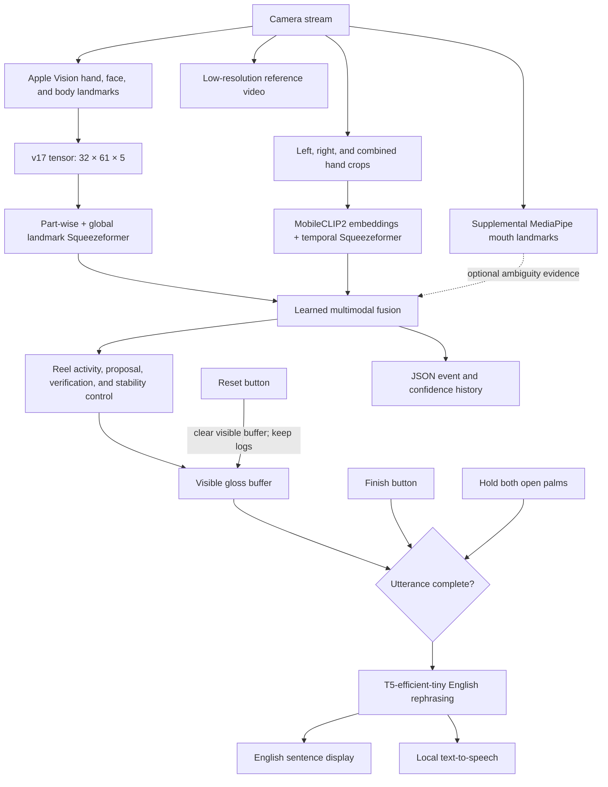
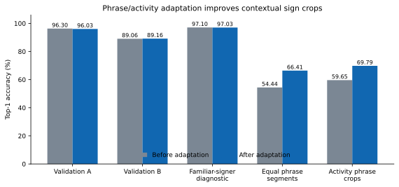
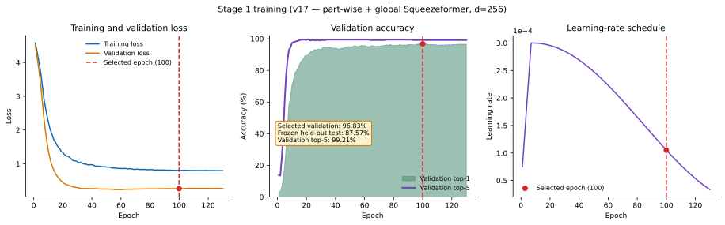
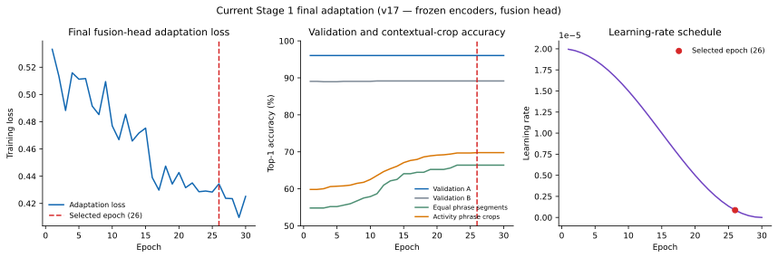
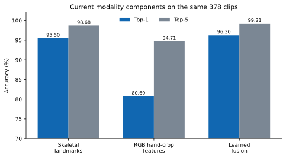
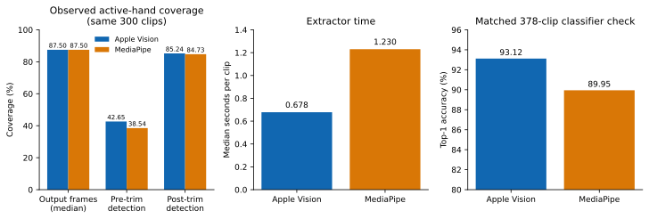
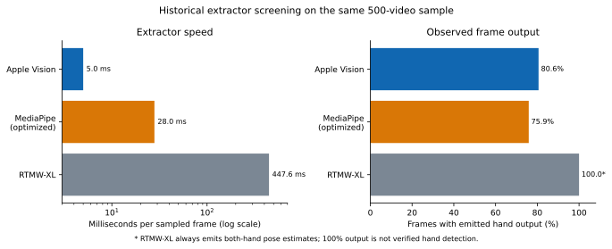
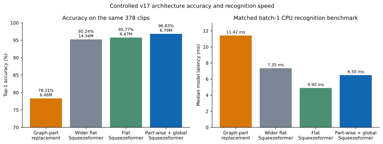
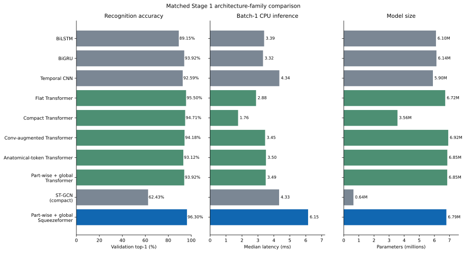
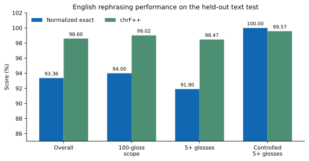

# Capstone 1 paper revision checklist

Reviewed document: `For Checking ATLAS (September) (1).pdf` (69 pages)

This is a correction guide for the next manuscript, not replacement prose for every
page. All corpus-facing labels below intentionally use **100-gloss corpus** so the
authors can insert the final provenance and citations later.

## Recommended title

**ATLAS: A Squeezeformer-Based System for Sign Language Recognition and English Translation**

This is the best current title: it keeps the English-translation objective, names the
main recognition architecture, and does not claim a deployment platform or a level of
real-time performance that has not yet been validated end to end.

Other defensible options:

1. **ATLAS: A Landmark-Based System for Sign Language Recognition and English Translation**
2. **ATLAS: An Application-Based Squeezeformer System for Sign Language Recognition and English Translation**
3. **ATLAS: A Real-Time Sign Language Recognition and English Translation System** — use only after the final application passes a documented live latency and accuracy evaluation.

Remove **Flan-T5** from the title. The current English component is a fine-tuned
T5-efficient-tiny model, and naming a replaceable submodel makes the title age quickly.

## One-paragraph description of the current system

ATLAS is a live sign-recognition and English-translation prototype for a fixed
100-gloss vocabulary. Camera frames are converted to hand, face, and upper-body
landmarks, while left-hand, right-hand, and combined-hand crops provide complementary
visual evidence. A part-wise and global Squeezeformer models the landmark sequence; a
second lightweight temporal branch models hand-crop embeddings; and a learned fusion
head combines their predictions. A Reel-style activity controller repeatedly proposes
and verifies signs while the signer moves naturally, then appends accepted glosses to
a visible buffer. Pressing Finish or holding both open palms sends the buffer to a
small locally executed T5 model that rephrases it as English, displays the sentence,
and passes it to text-to-speech. MediaPipe lip landmarks remain supplemental evidence,
not an independent lip-reading recognizer.

## Structural recommendation: stop calling the current design “three stages”

The current system is better described as cooperating **modules**:

- visual extraction;
- multimodal sign recognition;
- streaming activity and decision control;
- gloss buffering and utterance completion; and
- English rephrasing and speech output.

The former numbered-stage language implies that a CTC sequence recognizer must sit
between isolated recognition and translation. That is no longer true in the default
Reel prototype. The old CTC model may remain an experimental comparator or optional
arbiter, but it should not be drawn as part of the proposed system unless it is enabled
and evaluated in the final application.

## Paper-wide correction checklist

### Front matter

- [ ] Replace the existing title with the recommended title or one of the short alternatives above.
- [ ] Add an abstract. The current PDF proceeds from the title pages to acknowledgements and the table of contents without an abstract.
- [ ] Regenerate the table of contents, list of figures, and list of tables after editing. Their page references currently do not consistently match the body.
- [ ] Make the tense consistent: use past tense for completed experiments, present tense for the current system, and future tense only for unimplemented work.
- [ ] Define every acronym at first use, including SLR, Squeezeformer, TTS, MPS, and Core ML.

### Chapter 1: introduction, objectives, and scope

- [ ] Replace the old Apple/MediaPipe → isolated classifier → CTC → Flan-T5 description with the module-based current system above.
- [ ] Change the problem statement from processing a completed recording to recognizing signs from an ongoing camera stream.
- [ ] State that the current scope is a fixed 100-gloss vocabulary; do not retain the old 310-class claim.
- [ ] State that English generation is **bounded rephrasing of a recognized gloss buffer**, not unrestricted sign-language translation.
- [ ] Replace signer-dependent or random class-stratified evaluation language with signer-disjoint training, validation, and test language.
- [ ] State that the currently evaluated prototype runs on a Mac. Remove claims of completed Android or iOS deployment until those applications and their device measurements exist.
- [ ] Keep hand-crop RGB as the intended deployment visual branch; do not describe full-frame RGB as the current visual input.
- [ ] Describe MediaPipe mouth landmarks as supplemental nonmanual information. Do not claim general lip reading.
- [ ] Remove typed-response interaction from the current scope and diagrams.
- [ ] Replace “deaf and mute” with “Deaf and hard-of-hearing people,” “sign-language users,” or the terminology preferred by the target community.
- [ ] Add explicit limitations: fixed vocabulary, regional/individual signing variation, unseen environments and signers, possible landmark failure, finite utterance completion control, and no replacement for a qualified interpreter.

### Chapter 2: related literature and technical basis

- [ ] Keep the Squeezeformer discussion but connect it to the actual temporal landmark model: part-wise encoders followed by global temporal fusion.
- [ ] Add literature on part-wise sign modeling to justify separate hand, face, and body streams.
- [ ] Add efficient visual-encoder literature to justify hand crops and MobileCLIP2 embeddings.
- [ ] Reduce the CTC section or label it as a prior/alternative experiment rather than the proposed architecture.
- [ ] Add literature on streaming activity detection, endpointing, temporal stability, and online sign recognition. The Reel controller is not simply an isolated classifier loop.
- [ ] Separate external-paper results from local results. Do not compare accuracy percentages across different corpora as if they were one benchmark.
- [ ] Explain why nonmanual mouth evidence is supplemental: it can help with a small ambiguity set, but hand motion, location, orientation, body posture, and facial information jointly carry the sign.
- [ ] Add a short discussion of translation evaluation beyond exact match, including human semantic adequacy and grammaticality.

### Chapter 3: methodology and system design

- [ ] Replace the old input tensor `[B, 32, 61, 16]` with the actual extractor output `[B, 32, 61, 5]`: XYZ, presence, and confidence.
- [ ] Explain that velocity and acceleration are derived inside preprocessing/model preparation. Do not present them as raw extractor channels.
- [ ] Document the 61 nodes: 21 left hand, 21 right hand, 15 face, and 4 upper-body points.
- [ ] Document the independently normalized part-wise landmark streams and their later global Squeezeformer fusion.
- [ ] Document the RGB branch as 16 sampled time points with left-hand, right-hand, and combined-hand crops, not full-frame appearance modeling.
- [ ] Explain the learned fusion head and state that the visual and landmark components were trained before contextual adaptation.
- [ ] Describe phrase/activity adaptation accurately: the pretrained encoders were frozen and the fusion head was updated using 4,168 contextual sign crops.
- [ ] Explain the live cascade: a fast landmark proposal is followed by multimodal verification before a gloss is committed.
- [ ] Document the activity controller, candidate duration, repeated probing, stability checks, release logic, duplicate suppression, and zero transition overlap.
- [ ] Explain that displayed face/body landmarks may persist between extractor updates for visual continuity without inventing model observations.
- [ ] Document the supplemental GOOD/THANKYOU mouth verifier as experimental and opt-in; it is disabled by default.
- [ ] Document both utterance-completion controls: Finish button and a 0.4-second held two-open-palm gesture.
- [ ] State that Reset clears the visible buffer but deliberately retains audit logs.
- [ ] Document JSON history and low-resolution reference-video recording, including consent, retention period, access, and deletion controls.
- [ ] Replace CUDA-only wording with the actual Mac development path: Apple Silicon, MPS for training experiments when beneficial, CPU for the current autoregressive English model, and Core ML packages for measured recognition components.

### Chapter 4: results and discussion

- [ ] Insert the missing “Actual Model Performance and Current Limitations” section listed in the table of contents.
- [ ] Separate validation, held-out test, contextual-crop diagnostics, replay tests, and live-user observations into distinct tables.
- [ ] Never call 93.12% validation accuracy “test accuracy.”
- [ ] Report the frozen 100-gloss held-out test once: 87.57% top-1, 98.64% top-5, and 87.39% macro-F1 on 1,247 clips.
- [ ] Report current phrase-adapted validation values separately: 96.03% top-1 on Validation A and 89.16% on Validation B.
- [ ] State that 66.41% equal-phrase-crop and 69.79% activity-crop accuracy measure contextual cropped signs, not complete continuous sentences.
- [ ] Include the RGB-hand-crop versus skeletal-landmark versus learned-fusion comparison below.
- [ ] Include the Apple Vision versus MediaPipe comparison below, using the same clips for each extractor.
- [ ] Include both the controlled Squeezeformer-variant comparison and the matched architecture-family comparison below.
- [ ] Report both automatic and human English-output evaluation. The human form is supplied in `STAGE3_HUMAN_EVALUATION.md`; do not fill ratings without actual evaluators.
- [ ] Discuss error pairs by articulatory cause: handshape, location, orientation, motion, nonmanual signal, landmark loss, and streaming boundary error.
- [ ] Report latency by component and hardware. Do not add unrelated extractor, model, and endpointing medians together and call them end-to-end latency.

### Diagrams, requirements, and appendices

- [ ] Replace the old four-stage architecture figure with the flowchart in this report.
- [ ] Replace the completed-video flowchart with an ongoing stream and explicit utterance completion.
- [ ] Remove typed-response boxes from all activity, use-case, sequence, and data-flow diagrams.
- [ ] Update functional requirements to include live gloss display, Reset, Finish, finish gesture, speech synchronization, JSON history, and reference video.
- [ ] Update nonfunctional requirements with measurable targets: camera throughput, proposal latency, verification latency, English-rendering latency, memory, model size, and sustained thermal behavior.
- [ ] Do not claim that raw video is never retained while the prototype saves reference videos. Describe the actual behavior and safeguards.
- [ ] Add model/checkpoint identifiers, split rules, seeds, hardware, package versions, and evaluation commands to a reproducibility appendix.
- [ ] Correct broken reference wrapping and verify every in-text citation has one reference entry.

## Proposed current architecture



The finish gesture is control input and must be excluded from the gloss sequence. The
default Reel prototype does not require the old CTC path.

## Current implementation details for the methodology chapter

| Component | Current implementation |
| --- | --- |
| Vocabulary | Fixed 100-gloss corpus |
| Landmark input | 32 frames × 61 nodes × 5 raw channels |
| Raw channels | X, Y, Z, presence, confidence |
| Landmark nodes | 21 left hand + 21 right hand + 15 face + 4 body |
| Derived motion | Per-node velocity and acceleration, producing 11 prepared channels per node |
| Spatial relations | 66 selected pairwise hand-distance features |
| Landmark model | Four part-wise streams projected to 64 dimensions, then a 256-dimensional, four-block global Squeezeformer |
| RGB input | Left-hand, right-hand, and combined-hand crops at 16 time points |
| RGB encoder | MobileCLIP2 image embeddings with a three-block temporal Squeezeformer head |
| Fusion | Learned landmark/RGB logit fusion; initialized around a 75/25 landmark/visual weighting with trainable residual/gating terms |
| Context adaptation | Encoders frozen; fusion head adapted on 4,168 phrase/activity crops |
| Live recognition | Repeated 0.50-second candidate windows, 0.12-second probing, fast proposal, full verification, stability/commit controls, no transition overlap by default |
| Nonmanual evidence | Face nodes in the core landmark tensor; MediaPipe mouth markers are supplemental and the targeted mouth verifier is opt-in |
| Completion | Finish button or two open palms held for 0.4 seconds |
| English output | 15.58M-parameter fine-tuned T5-efficient-tiny model; local display and speech |
| Audit trail | JSON events/confidences plus low-resolution reference video; Reset retains the logs |

Approximate trainable/model parameter counts:

| Model component | Parameters |
| --- | ---: |
| Landmark Squeezeformer classifier | 6,791,717 |
| Hand-crop temporal classifier | 4,813,158 |
| Learned fusion head | 526,949 |
| Combined recognition classifier | 12,131,824 |
| English rephraser | 15.58 million |

The MobileCLIP2 image encoder is an upstream feature extractor and is not included in
the 12.13M recognition-classifier total.

### Clarification: the current model still contains part-wise encoding

The live Reel system is best named a **unified multimodal Squeezeformer**, because its
complete classifier contains a landmark branch, an RGB hand-crop branch, and learned
fusion. However, the landmark branch inside that current classifier is still
part-wise. The exact checkpoint loaded by `live_reel_stage1_v17.py` records:

```text
temporal_encoder = partwise_global
part_depth = 1
dim = 256
depth = 4
```

This was verified directly from
`artifacts/models/stage1_v17_unified_phrase_activity_adapt_reel_v2/best_model.pth`.
Therefore, “part-wise + global Squeezeformer” should remain in the methodology as the
**landmark submodel**, but it should not be presented as the entire current
architecture.

## Results that can be inserted into the paper

### 1. Primary recognition results

| Evaluation slice | Top-1 | Top-5 | Macro-F1 | Clips | Interpretation |
| --- | ---: | ---: | ---: | ---: | --- |
| Frozen 100-gloss held-out test, landmark model | 87.57% | 98.64% | 87.39% | 1,247 | One-time held-out test result; do not reuse for model selection |
| Current phrase-adapted Validation A | 96.03% | 99.21% | 95.71% | 378 | Current matched validation result |
| Current phrase-adapted Validation B | 89.16% | 96.73% | 84.67% | 978 | Harder secondary validation |
| Familiar-signer diagnostic | 97.03% | 99.65% | 91.27% | 2,896 | Diagnostic only; not generalization evidence |
| Equal phrase segments | 66.41% | 90.73% | — | 259 | Contextual sign crops, not sentence accuracy |
| Activity phrase crops | 69.79% | 91.02% | — | 1,036 | Contextual sign crops, not sentence accuracy |



Phrase/activity adaptation deliberately trades 0.27 percentage point on Validation A
for gains of 11.97 points on equal phrase segments and 10.14 points on activity crops.
Validation B changes by only +0.10 point. This supports the claim that adaptation makes
the recognizer less brittle in connected signing, but it does **not** establish
unconstrained continuous recognition.

#### Original Stage 1 training history

The following is the requested **Stage 1-only** chart. It reads the actual 130-epoch
history of the selected landmark classifier; it contains no phrase/activity adaptation
epochs and no reconstructed curves. The selected epoch was 100, with 96.83% validation
top-1. The separately frozen held-out test result was 87.57% top-1 and was not used to
select the epoch.



For completeness, the later 30-epoch adaptation is shown separately below. Only the
fusion head was updated during that phase, so its loss is adaptation loss rather than
full-model training loss.



### 2. RGB hand crops versus skeletal landmarks

These three rows use the same 378 evaluation clips. They are current component
checkpoints, not a perfectly controlled from-scratch causal ablation, so they should be
labelled a **matched-set component comparison**.

| Input/component | Top-1 | Top-5 | Macro-F1 | Practical interpretation |
| --- | ---: | ---: | ---: | --- |
| Skeletal landmarks | 95.50% | 98.68% | 95.15% | Strongest single component; compact and relatively appearance-invariant |
| RGB hand-crop features | 80.69% | 94.71% | 79.32% | Adds handshape/appearance detail but is weaker alone |
| Learned fusion | **96.30%** | **99.21%** | **96.02%** | Best matched result; visual evidence repairs a subset of landmark errors |



Recommended deployment direction: retain skeletal landmarks as the primary signal and
use cropped hands as complementary evidence. Hand crops avoid most irrelevant
background and full-frame appearance information while preserving visual handshape
detail that landmarks may lose.

### 3. MediaPipe versus Apple Vision extraction

The quality audit uses the same 300 clips for both extractors. The classifier check
uses the same 378 clips and the same model configuration/training protocol.

| Measure | Apple Vision | MediaPipe | Better result |
| --- | ---: | ---: | --- |
| Valid extracted clips | 300/300 | 300/300 | Tie |
| Active-output coverage, median | 87.50% | 87.50% | Tie |
| Pre-trim hand detection, median | **42.65%** | 38.54% | Apple Vision |
| Post-trim hand detection, median | **85.24%** | 84.73% | Apple Vision, narrowly |
| Extraction time, median | **0.678 s/clip** | 1.230 s/clip | Apple Vision |
| Matched classifier top-1 | **93.12%** | 89.95% | Apple Vision |
| Matched classifier top-5 | **99.47%** | 97.35% | Apple Vision |
| Matched classifier macro-F1 | **92.53%** | 89.81% | Apple Vision |

Secondary tracking proxies explain why the earlier chart could be misread:

| Secondary proxy | Apple Vision | MediaPipe | Correct interpretation |
| --- | ---: | ---: | --- |
| Active-output coverage, mean | 79.52% | 82.24% | MediaPipe output was slightly denser after trimming/interpolation |
| Hand-node presence, median | 43.38% | 46.88% | MediaPipe emits all 21 hand joints together, so this is not joint-level ground truth |
| Bone-length coefficient of variation, median | 0.2539 | 0.1818 | MediaPipe skeleton length was steadier; lower is better |



**Selection conclusion: Apple Vision won this project’s controlled comparison.** It had
higher raw pre-trim and post-trim active-hand detection, was about 1.8× faster per clip,
handled overlapping two-hand signs better in the visual audit, and improved downstream
top-1 by 3.17 points. The prior figure incorrectly foregrounded MediaPipe’s mean
postprocessed output coverage, which can rise through trimming/interpolation and is not
the same as genuine source-frame hand detection. The revised figure now shows median
output coverage and the two source-detection measures.

MediaPipe did produce denser/steadier postprocessed tracks on some proxies, but also
collapsed some overlapping two-hand signs to one hand and produced an observed
beard/chin false positive. The paired accuracy comparison was 26 clips correct only for
Apple versus 14 correct only for MediaPipe (`p = 0.0807`). That p-value limits a broad
population claim, but it does not reverse the engineering result on this Mac and these
matched clips.

#### Historical three-extractor screening: RTMW-XL, Apple Vision, and MediaPipe

The codebase also contains an older extractor-only screening in
`docs/md_files/SIMPLIFICATION_TEST_RESULTS.md`. All three extractors were evaluated on
the same 500-video sample, using 3,960 evenly sampled frames. This is a valid
within-screening speed/output comparison, but it is **not** the current v17 bakeoff and
does not provide matched downstream recognition accuracy for RTMW-XL.

| Extractor | Speed/frame | Frame output | Video output | Hands/frame | Relative speed versus Apple |
| --- | ---: | ---: | ---: | ---: | ---: |
| Apple Vision | **5.0 ms** | 80.6% | 96.8% | 1.14 | **1.0×** |
| MediaPipe, optimized | 28.0 ms | 75.9% | 96.4% | 1.03 | 5.6× slower |
| RTMW-XL | 447.6 ms | 100%* | 100%* | 2.00* | 89.5× slower |



The RTMW-XL `100%` values must not be called 100% hand-detection accuracy. RTMW-XL is a
top-down whole-body pose estimator: after a person is located, it emits estimates for
both hands even when a hand is absent or hidden. This explains the fixed 2.0 hands per
frame and creates ghost-hand risk. Apple Vision and MediaPipe are detection-first and
can return no hand. The legacy notes contain different RTMW ghost percentages for
different stress-test denominators, so this report deliberately does not merge them
into one unsupported rate.

The paper should therefore use two clearly labelled results: this historical
same-video **extractor screening** to explain why RTMW-XL was rejected for live use,
and the newer v17 **Apple Vision versus MediaPipe bakeoff** above to justify the current
extractor selection. It should not splice RTMW-XL's old output rate into the current
v17 classifier table.

The official documentation does not provide a controlled Apple Vision-versus-MediaPipe
benchmark. Apple documents per-joint observations and notes that requesting more hands
increases latency; Google documents asynchronous live-stream operation and warns that
frames may be dropped to reduce latency. Those sources establish capability, not which
extractor is faster or more accurate here. The local frozen head-to-head above is the
relevant comparison. MediaPipe remains useful for supplemental live mouth markers.

### 4. Architecture accuracy, efficiency, and recognition speed

#### Squeezeformer design variants

The accuracy columns use the same 378 clips and controlled v17 protocol. Because the
older comparison did not include one runtime measurement for every architecture, a new
matched benchmark was run on this Mac: batch one, one real `[1,32,61,5]` validation
tensor, PyTorch CPU with one thread, 20 warmups, and 300 timed predictions per model.
This measures **classifier computation after landmarks already exist**.

| Architecture | Parameters | Top-1 | Top-5 | Macro-F1 | Median | P90 |
| --- | ---: | ---: | ---: | ---: | ---: | ---: |
| Graph-part replacement | 6.48M | 78.31% | 95.77% | 77.58% | 11.42 ms | 11.86 ms |
| Wider flat Squeezeformer | 14.34M | 95.24% | 99.74% | 94.90% | 7.35 ms | 7.80 ms |
| Flat Squeezeformer | 6.47M | 95.77% | 100.00% | 95.51% | **4.90 ms** | **5.09 ms** |
| Part-wise + global Squeezeformer | 6.79M | **96.83%** | 99.21% | **96.61%** | 6.50 ms | 6.96 ms |



The flat 256-dimensional model is the fastest landmark architecture, but the part-wise
model adds only 1.60 ms median in this controlled CPU benchmark and gains 1.06 top-1
points. The graph replacement is both least accurate and slowest. The part-wise design
therefore remains the selected landmark submodel. Each anatomical part receives its own
temporal representation before global modeling; it is not merely a name for “Motion
Valley” or continuous extraction.

### What “speed in recognizing one sign” means in the live prototype

Model latency is only one part of camera-to-gloss delay. The current live system first
observes enough motion for a candidate and may then invoke the RGB hand verifier.

| Measured component | Median | Included |
| --- | ---: | --- |
| Current landmark proposal, Core ML | 16.31 ms | Prepared 32-frame landmark tensor → logits |
| Current unified classifier, Core ML | 8.64 ms | Prepared landmarks and precomputed hand embeddings → fused logits |
| Full baseline visual verification | 359.00 ms | Hand-crop embedding plus unified verification in matched replay |
| Cached experimental visual verification | 304.15 ms | Same output with exact-input embedding reuse |
| Selected live committed candidate duration | 0.67 s | Activity observation/window policy before a committed gloss |

The 8.64 ms fused-model number cannot be added to 16.31 ms and called end-to-end
latency: the cascade runs them conditionally, and hand-image embedding dominates a full
verification. The 0.67-second value is the closest recorded measure of perceived
single-gloss commit speed, but it comes from five development phrase replays and still
needs an independent live-user timing evaluation.

#### Matched architecture-family experiment

The earlier literature-only table is now replaced by a real local experiment. All ten
families used the same 2,863 training samples, class/source-balanced sampling, exact
augmentation, AdamW optimizer and schedule, label smoothing, EMA checkpoint selection,
seed 1701, and the same 378-clip signer-disjoint validation split. Training ran on MPS;
the final metrics were independently reproduced from each persisted checkpoint on CPU.
The held-out test was not loaded. Latency uses the same real validation tensor and the
same batch-one, single-thread CPU protocol: 20 warmups and 300 timed predictions.

| Family | Parameters | Best epoch | Top-1 | Top-5 | Macro-F1 | Median | P90 |
| --- | ---: | ---: | ---: | ---: | ---: | ---: | ---: |
| BiLSTM | 6.10M | 47 | 89.15% | 98.68% | 88.06% | 3.33 ms | 3.43 ms |
| BiGRU | 6.14M | 59 | 93.92% | 98.94% | 93.36% | 3.25 ms | 3.33 ms |
| Temporal CNN | 5.90M | 67 | 92.59% | 98.94% | 92.01% | 4.30 ms | 4.39 ms |
| Flat Transformer, 8 layers | 6.72M | 97 | 95.50% | 98.94% | 95.16% | 2.88 ms | 3.00 ms |
| Compact Transformer, 4 layers | 3.56M | 52 | 94.71% | 98.94% | 94.50% | **1.76 ms** | **1.91 ms** |
| Convolution-augmented Transformer | 6.92M | 59 | 94.18% | **99.47%** | 93.75% | 3.45 ms | 3.54 ms |
| Anatomical-token Transformer | 6.85M | 92 | 93.12% | 99.21% | 92.71% | 3.50 ms | 3.60 ms |
| Part-wise + global Transformer | 6.85M | 105 | 93.92% | 99.21% | 93.62% | 3.49 ms | 3.57 ms |
| ST-GCN, compact | 0.64M | 72 | 62.43% | 84.92% | 61.14% | 4.33 ms | 4.51 ms |
| Part-wise + global Squeezeformer | 6.79M | 57 | **96.30%** | 98.94% | **96.14%** | 6.15 ms | 6.25 ms |



The original Transformer baseline is **flat**: all 61 landmarks and 66 hand-distance
features are concatenated into one frame vector before an eight-layer global
Transformer. The new part-wise Transformer instead applies a 64-dimensional Transformer
to each hand, face, and body stream before concatenation and the same eight-layer global
Transformer. It is closely parameter-matched to both the flat Transformer and
Squeezeformer.

Part-wise processing did not help the vanilla Transformer. It reached 93.92% top-1,
1.59 points below the flat Transformer and 2.38 points below Squeezeformer, while also
being 0.69 ms slower than the flat model. Its 99.21% top-5 suggests the correct class
often remains among its alternatives, but its top-1 ranking is worse. One plausible
interpretation is that early 64-dimensional part streams bottleneck cross-part evidence,
whereas Squeezeformer's local convolution modules make that separation useful for
short-range anatomical motion. This experiment supports the combination of part-wise
modeling **and** Squeezeformer blocks, not part-wise splitting by itself.

Three additional Transformer challengers test distinct hypotheses:

- The **compact Transformer** removes four of the eight global layers. It retains
  94.71% top-1 with 3.56M parameters and 1.76 ms median latency. Relative to the full
  flat Transformer, it gives up only 0.79 point while reducing parameters by 47.1% and
  latency by 39.1%. This is the strongest compact deployment candidate.
- The **convolution-augmented Transformer** adds a gated depthwise temporal convolution
  before the eight global layers. It reaches 94.18%, below the unchanged flat model;
  one added local-convolution adapter is therefore insufficient to reproduce the
  complete Squeezeformer design.
- The **anatomical-token Transformer** is the landmark-domain analogue of ViT-style
  tokenization: each frame becomes four learned anatomical tokens that exchange
  information through spatial self-attention before temporal modeling. It reaches
  93.12%; compressing 61 nodes into four tokens loses useful detail in this corpus.

A literal Vision Transformer would divide RGB images into patch tokens. That would be
a different input modality, preprocessing pipeline, and compute budget, so it is not a
controlled replacement for this landmark encoder. If RGB ViT is evaluated later, it
should be compared against the existing RGB hand-crop branch on exactly the same crops,
not inserted into this skeletal-landmark table.

Squeezeformer remains the recognition-quality winner: it leads the flat Transformer by
0.79 point in top-1 and 0.99 point in macro-F1. The compact Transformer—not the full
flat model—is now the latency and parameter-efficiency candidate. The compact ST-GCN
uses the standard lightweight 64/128-channel schedule
and is about one-tenth the size of the other models; its poor result shows that this
compact instantiation underfits the task, not that all possible ST-GCN designs are
inferior. This is a controlled single-seed validation comparison. For a publication
claim about small differences, repeat at three seeds and report mean and standard
deviation.

Do not mix the 96.30% result above with the historical 96.83% Squeezeformer-variant
result: the former is the matched architecture-family rerun on this Mac, while the
latter belongs to the earlier design-selection run. Neither is held-out test accuracy.

### 5. English rephrasing results

The current 15.58M-parameter model was fine-tuned for one epoch and evaluated on a
held-out text split. The `100-gloss scope` row is the most relevant result.

| Slice | Normalized exact match | chrF++ | Test examples |
| --- | ---: | ---: | ---: |
| Overall | 93.36% | 98.60 | 1,596 |
| 100-gloss scope | 94.00% | 99.02 | 100 |
| Five or more glosses | 91.90% | 98.47 | 210 |
| Controlled 100-gloss, five or more | 100.00% | 99.57 | 26 |



A warm nine-gloss live generation measured 137.96 ms median on CPU. MPS was slower for
autoregressive generation (1,678.02 ms median), so CPU is the current live default and
does not compete with the recognition work. Exact match mainly measures agreement with
the prepared references; it cannot by itself prove semantic faithfulness or natural
English. Use the supplied blinded human-evaluation form before writing a final quality
claim.

## Copy-ready revisions

### Purpose paragraph

> This study develops ATLAS, a live sign-language recognition and English-translation
> prototype for a fixed 100-gloss vocabulary. The system combines skeletal landmark
> sequences with cropped-hand visual features, recognizes signs from an ongoing camera
> stream, collects accepted glosses in a visible buffer, and rephrases the completed
> sequence as an English sentence for display and speech. It is intended as a research
> prototype for responsive human-computer interaction, not as a replacement for a
> qualified interpreter.

### General objective

> To design and evaluate a responsive multimodal system that recognizes signs from a
> fixed 100-gloss vocabulary during live signing and converts a completed gloss sequence
> into an English sentence.

### Specific objectives

1. To compare skeletal landmark extraction and cropped-hand visual features on the same evaluation clips.
2. To compare Apple Vision and MediaPipe landmark extraction in terms of landmark coverage, stability, processing time, and downstream recognition accuracy.
3. To develop and evaluate a part-wise and global Squeezeformer recognizer with learned landmark/hand-crop fusion.
4. To adapt the recognizer to sign crops observed in phrase and activity contexts without replacing the original encoders.
5. To implement live activity-controlled sign proposals, verification, visible gloss buffering, explicit utterance completion, English rephrasing, and text-to-speech.
6. To evaluate recognition using top-1 accuracy, top-5 accuracy, and macro-F1, and to evaluate English output using automatic metrics and human ratings.

### Scope and limitations paragraph

> The study is limited to a fixed 100-gloss corpus and an English rephrasing component
> trained for sequences composed from that vocabulary. The current evaluation covers a
> Mac-based prototype and signer-disjoint recorded clips; it does not establish
> unrestricted sign-language understanding, arbitrary-vocabulary continuous
> recognition, production mobile performance, or equivalence to human interpretation.
> Recognition may still fail because of signer variation, camera viewpoint, occlusion,
> missing or swapped landmarks, visually similar signs, nonmanual distinctions, and
> streaming boundary decisions. MediaPipe mouth landmarks are supplemental evidence
> only. The live system stores JSON event history and a low-resolution reference video,
> so participant consent and explicit retention/deletion controls are required.

## What can and cannot be claimed now

Safe claims:

- The selected part-wise + global Squeezeformer outperformed controlled flat and graph-part alternatives on the matched 378-clip evaluation.
- In a separate same-protocol family benchmark, Squeezeformer achieved the highest validation top-1 and macro-F1, while Transformer had the lowest classifier-only CPU latency.
- Learned fusion outperformed either the landmark or hand-crop component alone on the matched component set.
- Phrase/activity adaptation improved contextual sign-crop accuracy while preserving isolated validation accuracy within 0.27 point.
- The Reel prototype performs ongoing activity-controlled classification without requiring CTC by default.
- The English model handles tested five-or-more-gloss sequences well on the held-out prepared text set.

Claims that still require evidence:

- “Real-time” as a formal end-to-end claim across representative hardware and sessions.
- General continuous sign recognition or unrestricted sign-language translation.
- Production mobile speed, memory, energy, and thermal behavior.
- General lip-reading capability.
- Human-level translation, interpreter replacement, or universal signer generalization.
- Human English-output quality until the supplied evaluation is actually rated.

## Recommended additional evaluation before the final defense

1. Collect a sealed live session set with complete utterances, signer identities kept out of development, and synchronized ground-truth gloss sequences.
2. Report streaming gloss error rate, insertion/deletion/substitution counts, time-to-first-correct-gloss, commit delay, false activations per minute, and utterance exact match.
3. Evaluate Finish-button and finish-gesture completion separately, including accidental-trigger rate.
4. Run the 30-item English human evaluation with three raters when possible; report means, standard deviations, and inter-rater agreement.
5. Profile sustained live use on the eventual target device before changing the title to “Real-Time” or claiming mobile readiness.

## Evidence and references

Local evidence used for this revision:

- `artifacts/reports/STAGE1_V17_SQUEEZEFORMER_EXHAUSTIVE_AUDIT.md`
- `artifacts/reports/COREML_V17_D256_D384_COMPARISON.md`
- `artifacts/reports/extractor_bakeoff_v17.csv`
- `artifacts/reports/capstone1_v17_revision_checklist_v1/architecture_latency_benchmark.json`
- `artifacts/reports/capstone1_v17_revision_checklist_v1/stage1_family_benchmark/result.json`
- `artifacts/reports/stage1_v17_test_frozen_apple/REPORT.md`
- `artifacts/reports/streaming_stage1_head_v17_experiment_v1/README.md`
- `artifacts/reports/stage3_v17_t5_efficient_tiny_locked100_v1/README.md`
- `artifacts/reports/live_reel_stability_sweep_v1/README.md`
- `artifacts/reports/live_reel_cached_stage1_v17_experiment_v1/README.md`

Relevant primary literature:

- Vaswani et al., [Attention Is All You Need](https://papers.nips.cc/paper_files/paper/2017/hash/3f5ee243547dee91fbd053c1c4a845aa-Abstract.html).
- Dosovitskiy et al., [An Image Is Worth 16×16 Words: Transformers for Image Recognition at Scale](https://openreview.net/forum?id=YicbFdNTTy).
- Gulati et al., [Conformer: Convolution-augmented Transformer for Speech Recognition](https://arxiv.org/abs/2005.08100).
- Kim et al., [Squeezeformer: An Efficient Transformer for Automatic Speech Recognition](https://proceedings.neurips.cc/paper_files/paper/2022/hash/3ccf6da39eeb8fefc8bbb1b0124adbd1-Abstract.html).
- Lee et al., [Human Part-wise 3D Motion Context Learning for Sign Language Recognition](https://openaccess.thecvf.com/content/ICCV2023/html/Lee_Human_Part-wise_3D_Motion_Context_Learning_for_Sign_Language_Recognition_ICCV_2023_paper.html).
- Zhang et al., [MediaPipe Hands: On-device Real-time Hand Tracking](https://arxiv.org/abs/2006.10214).
- Apple, [Detect Body and Hand Pose with Vision](https://developer.apple.com/videos/play/wwdc2020/10653/).
- Apple, [`VNDetectHumanHandPoseRequest`](https://developer.apple.com/documentation/vision/vndetecthumanhandposerequest).
- Google, [MediaPipe Hand Landmarker](https://ai.google.dev/edge/api/mediapipe/python/mp/tasks/vision/HandLandmarker).
- Apple, [MobileCLIP2: Improving Multi-Modal Reinforced Training](https://machinelearning.apple.com/research/mobileclip2).

The chart source is `make_charts.py`; PNG files are manuscript-ready and SVG files are
provided for lossless editing.
