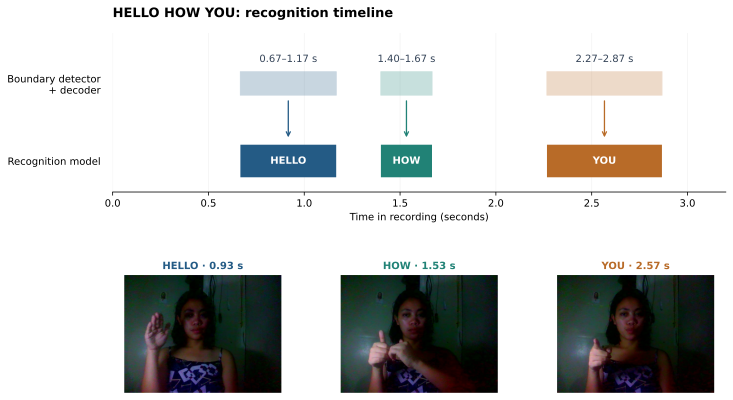

# ATLAS manuscript — exact wording and figure review

Updated: **2026-10-08**. **PROPOSALS ONLY — not applied to the manuscript.**

Source: [Capstone 2: ATLAS — (Oct 6) Revision](https://docs.google.com/document/d/1sC2JZ23mSpnLWeEEFDm5ce2x_As0XTS7ayMGvk5uuD4/edit?tab=t.pzqwjycim1ix), read live on October 8. Before passages below are exact extracts unless identified as a table transcription or a proposed insertion. Current figure numbers identify the existing manuscript; final numbering will follow approved removals.

Check each item independently. Write changes under **Your note** using the item ID. The old checklist and its author comments are preserved in [the October 7 archive](review_assets/20261008_proposals/README_PLATFORM_NEUTRAL_REVIEW_20261007_archive.md).

## What validation, evaluation and test mean here

**Evaluation set** is a general term, not a synonym for **test set**. Validation/development data are used to assess candidates and select models or settings. An independent test set is reserved from those decisions and assesses the frozen selection.

The proposed **95.53% is validation accuracy**. The **31.42% is development/tuning-set gloss-sequence WER**, used in recognizer selection. Neither is an independent test result. The 94.40% equal-dataset average is a different calculation and will not be substituted for 95.53%.

Paper wording below uses **validation dataset**, **validation accuracy**, and **development-set WER**. It does not use “pooled,” list three dataset names, or give validation-set sizes in the paper passages. The computation remains total correct predictions divided by total evaluated examples. One final configuration is presented; no August-versus-current comparison.

**Preserved by instruction:** existing signer-disjoint discussion, slides, participant plans, schedules, unrelated literature and separately evaluated English-generation results. This preservation does not establish that the combined 95.53% result is signer-disjoint; no new such attribution is proposed.

## Exact prose and table changes

### R-01 — Define the reported validation result

- [ ] Approve R-01

**Before — current manuscript:**

> Each comparison retains its own task and measurement conditions. Recognition percentages below describe the corresponding validation studies, while the streaming comparison uses the same recorded sequences for both configurations. Base-classifier CPU timings use prepared inputs; the mobile-device measurements include the stated processing work on the device. Detailed hardware, recording membership and source records are retained in the measurement notes. This separation allows each result to answer the engineering question for which it was measured.

**After — proposed wording:**

> Recognition performance is reported for the final ATLAS recognizer. Validation accuracy is calculated by dividing the number of correctly classified isolated-sign examples by the total number of examples in the validation dataset. Gloss-sequence word error rate is reported separately on the development set used for recognizer selection. Processing time describes the measured preparation and recognition work on the evaluation device.

**Note:** Replaces the comparison-oriented introduction in Section 4.4. It makes the denominator definition explicit without calling the result pooled or test accuracy.

**Your note:**

### R-02 — Replace the old pipeline-stage results

- [ ] Approve R-02

**Before — current manuscript:**

> The Apple Vision and MediaPipe pipelines were compared across three recognition stages using the same validation set and vocabulary. The landmark-only base recognizer uses structured movement information. The combined-input recognizer adds hand-image features, while the interval-adapted recognizer is prepared for candidate sign intervals during streaming. Table 11 and Figure 11 compare isolated-sign validation accuracy at these stages.
> 
> The Apple Vision pipeline recorded higher validation Top-1 accuracy at each of the three stages in this comparison. Combining landmark and hand-image features produced 96.30% accuracy for Apple Vision inputs and 94.44% for MediaPipe inputs. After adaptation to candidate intervals, the corresponding isolated-sign validation values were 95.24% and 94.44%. These results describe the evaluated configurations rather than every possible implementation of either extractor.
> 
> Processing speed was measured on the same Apple M4 development computer using identical recordings from the same validation set. Each clip's measured stages were combined: landmark extraction and preparation, applicable hand-image feature extraction, and recognition. Initial video decoding, model loading, English generation, and speech output were excluded. The Apple Vision pipeline recorded median times of 356.1, 668.6, and 668.7 ms per clip for the landmark-only, combined-input, and interval-adapted stages, respectively. The corresponding MediaPipe results were 546.7, 809.3, and 808.6 ms. Figure 11 presents these development-computer measurements alongside recognition accuracy; device processing is evaluated separately.

**After — proposed wording:**

> The final ATLAS recognizer achieved 95.53% validation accuracy for isolated-sign classification within the selected 100-sign vocabulary. Table 11 presents this result. This measure assesses the identity of an individual sign; recognition of a connected sequence also requires the system to determine sign intervals and maintain the order of accepted glosses.

**Note:** Section 4.4.1. Remove the old Apple Vision/MediaPipe stage comparison and its old Mac timings from this final-result passage. Those measurements are not reassigned to the new recognizer.

**Your note:**

**R-02 table replacement — exact content**

Before: **Table 11**, current recognition-stage comparison (transcribed values).

| Recognition stage | Apple Vision Top-1 | MediaPipe Top-1 |
|---|---:|---:|
| Landmark-only | 95.77% | 91.80% |
| Combined inputs | 96.30% | 94.44% |
| Interval-adapted | 95.24% | 94.44% |

After: **Table 11. Validation Accuracy of the Final ATLAS Recognizer**

| Model | Validation Top-1 accuracy |
|---|---:|
| ATLAS final recognizer | **95.53%** |

### R-03 — Move input combination into methodology

- [ ] Approve R-03

**Before — current manuscript:**

> Landmarks provided the stronger individual input, reaching 95.50% Top-1 accuracy compared with 80.69% for hand-image features. Combining the inputs reached 96.30%, an increase of 0.80 percentage points over landmarks alone. The improvement supports complementary use of motion and appearance within the recognition component without implying that either input contributes equally.

**After — proposed wording:**

> The recognizer combines landmark motion with hand-image features. Local adaptation prepares the landmark branch for the application’s signing inputs, while fixed weighted score fusion combines the complementary predictions of the landmark and hand-image branches. Phrase-segment and interval adaptation subsequently prepare the recognizer for candidate sign intervals encountered during connected signing.

**Note:** Remove Table 12 and the old 80.69%/95.50%/96.30% comparison. Insert the replacement paragraph in Section 4.3.3. The selected fusion checkpoint was epoch 0; its gain cannot be attributed to fusion-stage distillation. Boundary-model distillation remains a separate, valid method.

**Your note:**

### R-04 — Consolidate architecture evidence

- [ ] Approve R-04

**Before — current manuscript:**

> The architecture comparison considered how landmark information should be organized before temporal classification. Table 13 reports earlier design-screening checkpoints; Table 14 reports a separate matched training experiment. Their Squeezeformer results therefore refer to different trained models. Both tables concern landmark-based classifiers and exclude the hand-image encoder and combined recognition model. M denotes millions of parameters, and CPU median denotes classifier inference on prepared inputs on the development Mac. A flat model processes the input together, part-wise processing first represents anatomical regions, and the graph-part alternative represents connections between landmarks.
> 
> Part-wise and global Squeezeformer processing achieved the highest Top-1 accuracy in this comparison, at 96.83%. Relative to the flat Squeezeformer, the gain was 1.06 percentage points with an additional 1.60 milliseconds of median classifier computation. The flat model was faster and achieved the highest Top-5 value, while the selected architecture prioritized the correctness of the first prediction presented by recognition.
> 
> In the matched experiment, Squeezeformer achieved 96.30% validation Top-1 accuracy versus 95.50% for the flat Transformer, a difference of 0.79 percentage points. Transformer was faster on the development Mac CPU: 2.88 versus 6.15 milliseconds. However, a separate iPhone 13 comparison of the same two classifiers in FP16 measured 0.95 milliseconds for Transformer and 0.99 milliseconds for Squeezeformer. Both retained their original validation predictions. The 0.04-millisecond difference was small relative to variation across four counterbalanced runs. Thus, Squeezeformer provided higher measured accuracy with similar FP16 classifier speed on the evaluated phone. These single-seed accuracy results do not establish general architectural superiority. Classifier timings exclude landmark extraction, hand-image encoding and streaming processing; they are separate from the system's historical 28-millisecond measurement.

**After — proposed wording:**

> The base landmark classifiers were evaluated using the same isolated-sign validation inputs. The selected part-wise and global Squeezeformer achieved the highest Top-1 accuracy among the three configurations in Table 13. These measurements concern the landmark classifier before local, multimodal and interval adaptation. They are separate from the final recognizer’s validation accuracy reported in Table 11. The results describe the evaluated checkpoints and do not establish general superiority of one model family.

**Note:** Replace Tables 13 and 14 with one compact base-classifier table below. Remove the intervening old model-family comparison paragraph, old CPU times and historical 28 ms reference. Selected historical checkpoints share an evaluation, not a newly matched from-scratch training experiment. This item explicitly proposes removing the BiLSTM, temporal CNN, graph and wider-model screening rows from the main paper.

**Your note:**

**R-04 table replacement — exact content**

Before: **Table 13. Earlier Landmark Architecture Screening** (current cell contents).

| Architecture | Parameters | Top-1 | Top-5 | CPU median |
|---|---:|---:|---:|---:|
| Graph-part replacement | 6.48 M | 78.31% | 95.77% | 11.42 ms |
| Wider flat Squeezeformer | 14.34 M | 95.24% | 99.74% | 7.35 ms |
| Flat Squeezeformer | 6.47 M | 95.77% | 100.00% | 4.90 ms |
| Part-wise + global Squeezeformer | 6.79 M | 96.83% | 99.21% | 6.50 ms |

Before: **Table 14. Matched Recognition Family Comparison** (current cell contents).

| Model family | Parameters | Validation top-1 | CPU median |
|---|---:|---:|---:|
| BiLSTM | 6.10 M | 89.15% | 3.39 ms |
| Temporal CNN | 5.90 M | 92.59% | 4.34 ms |
| Flat Transformer | 6.72 M | 95.50% | 2.88 ms |
| ATLAS (part-wise + global Squeezeformer) | 6.79 M | 96.30% | 6.15 ms |

After: **Table 13. Base Landmark Classifier Comparison**

| Classifier | Parameters | Validation Top-1 accuracy |
|---|---:|---:|
| Flat Transformer | 6.72 M | 95.50% |
| Flat Squeezeformer | 6.47 M | 95.77% |
| Part-wise and global Squeezeformer | 6.79 M | 96.83% |

“M” denotes millions of parameters. These figures remain component measurements; none is presented as final ATLAS accuracy. No replacement comparison chart is proposed.

### R-05 — One sequence-recognition result

- [ ] Approve R-05

**Before — current manuscript:**

> Individual-sign accuracy does not fully describe connected signing, where the system must also decide when a sign begins, ends and becomes stable enough to accept. The streaming comparison therefore measures sequence errors across two complete configurations on the same recordings. Boundary-guided interval classification passes predicted intervals to recognition; ATLAS streaming recognition combines the distilled boundary model, interval-adapted recognition and sequence selection.
> 
> Word error rate decreased from 39.78% to 9.68%, a difference of 30.10 percentage points. This reflects the combined configuration, rather than an isolated effect of boundary distillation. The recordings include familiar-signer and unseen-signer sequences, providing a development comparison of how the system handles connected input. The result supports coordinating interval detection, recognition and gloss commitment instead of judging the streaming workflow solely from individual-sign accuracy.

**After — proposed wording:**

> Connected signing requires both sign identification and the selection of appropriate sign intervals. The final ATLAS recognizer obtained a development-set gloss-sequence word error rate of 31.42%, as presented in Table 15. Word error rate accounts for substitutions, deletions and insertions relative to the reference gloss sequence. The development set guided model selection; this result is therefore reported as development performance.

**Note:** Remove the 39.78% versus 9.68% comparison and the 30.10-percentage-point reduction claim. Keep one WER. Do not describe it as English translation error, held-out test WER, or convert it into 68.58% recognition accuracy.

**Your note:**

**R-05 table replacement — exact content**

Before: the current streaming table contains boundary-guided interval classification **39.78%** and ATLAS streaming recognition **9.68%**.

After: **Table 15. Development-Set Sequence Recognition Performance**

| Configuration | Gloss-sequence WER |
|---|---:|
| ATLAS final recognizer | **31.42%** |

### R-06 — Describe the mobile evaluation accurately

- [ ] Approve R-06

**Before — current manuscript:**

> The current ATLAS implementation should not, however, be described as a completed production mobile deployment. The evaluated implementation is Mac-based and has been tested using signer-disjoint recorded clips and controlled live testing. The current evaluation does not establish production-level Android or iOS performance, power consumption, thermal behavior, or unrestricted conversational operation.

**After — proposed wording:**

> ATLAS has been evaluated using recorded inputs on a development computer and an iPhone 13. These measurements establish prototype recognition and device-processing performance within the study’s defined conditions. They do not establish unrestricted conversational operation or production-level performance across mobile devices.

**Note:** Replaces the outdated Mac-only evaluation description in Chapter 2. Keep platform-neutral general terminology and device attribution with the measurement. This does not claim that the newly evaluated checkpoint has replaced the production default.

**Your note:**

### R-07 — Conversion wording — complete-dataset check pending

- [ ] Approve R-07

**Before — current manuscript:**

> The FP32 and FP16 recognizer exports were evaluated using the same validation inputs and reference labels. Landmark and cached hand-image inputs were held constant to examine the recognizer's predictions separately from changes in visual extraction. The comparison found similar recognition accuracy, while the device evaluation examined the processing cost of each precision configuration.
> 
> The FP32 recognizer recorded 95.24% validation Top-1 accuracy, compared with 94.97% for FP16. Top-5 accuracy was 98.94% for both. These values describe the interval-adapted recognizer, whereas the model-family comparison reports separately trained configurations.

**After — proposed wording:**

> The recognizer’s FP32 and FP16 exports were evaluated using identical prepared landmark and hand-image inputs. The conversion assessment compared their predicted sign labels with those of the trained model to determine whether reduced precision changed recognition decisions.

**Note:** This is the fixed wording proposed now. Do not append a complete-dataset accuracy-preservation claim until that check is completed. Existing conversion evidence covers the primary validation subset only. The final table values below are deliberately marked pending in this review, not asserted as measured.

**Your note:**

**R-07 conversion table — exact proposed structure, not ready to apply**

Before, current Table 18 recognition rows:

| Measure | FP32 | FP16 |
|---|---:|---:|
| Validation Top-1 accuracy | 95.24% | 94.97% |
| Validation Top-5 accuracy | 98.94% | 98.94% |

After, use one accuracy definition matching Table 11:

| Measure | FP32 export | FP16 export |
|---|---:|---:|
| Validation Top-1 accuracy | **Pending complete-dataset conversion check** | **Pending complete-dataset conversion check** |

If both exports preserve all evaluated predictions, the exact replacement values will be **95.53% / 95.53%**, followed by:

> Both exports achieved 95.53% validation accuracy and preserved the trained recognizer’s top-1 predictions on the validation dataset.

**This sentence is conditional, not an approved result.** If predictions differ, insert the measured values and revise the sentence accordingly. Omit the old Top-5 row unless Top-5 is recomputed for the same complete dataset. No new benchmark or model training is represented as completed by this checklist.

### R-08 — Use consistent storage definitions

- [ ] Approve R-08

**Before — current manuscript:**

> Model sizes compare saved FP32 inference weights with complete FP16 deployment packages, in decimal megabytes. They describe model storage rather than working memory or the size of the complete application.

**After — proposed wording:**

> Recognizer storage is reported as the size of the complete deployment package in decimal megabytes. The FP32 recognizer package occupies 50.28 MB, while the FP16 package occupies 25.51 MB. These measurements describe model storage rather than working memory or the size of the complete application.

**Note:** Replace the recognizer’s old 49.62 MB saved-weight value with its measured 50.28 MB FP32 package size. For a compact final-configuration table, retain only the 25.51 MB FP16 entry; the two-value wording is available if the precision comparison is retained.

**Your note:**

**R-08 table change — exact content**

Before: recognizer saved model size **49.62 MB / 25.51 MB**; boundary saved model size **9.25 MB / 4.68 MB**.

After, recognizer row: **Recognizer deployment package size | 50.28 MB | 25.51 MB**.

Remove the boundary storage row from this recognizer conversion table rather than silently treating its FP32 saved weights as an FP32 deployment package. The boundary model remains in the model inventory and architecture explanation.

### R-09 — One final phone-processing measurement

- [ ] Approve R-09

**Before — current manuscript:**

> On the iPhone 13, the current FP16 visual and recognition configuration recorded 24.1 ms per processed frame, compared with 112.6 ms for the corresponding FP32 configuration. Both used identical recorded inputs, and English generation remained FP32 and outside the timed work. The reported values are the medians of two run medians per configuration. Figure 13 compares these integrated configurations; the difference should not be attributed to numerical precision alone. Timing includes frame preparation and recognition, rather than camera capture or complete English and speech output.

**After — proposed wording:**

> On iPhone 13, the evaluated FP16 configuration recorded a median processing time of 23.69 ms per frame for preparation and recognition. The value is the median of two run medians measured using recorded inputs. Camera capture, model loading, interface updates, English generation and speech output were outside the timed work.

**Note:** Remove the old 24.1 versus 112.6 ms comparison and Figure 13. Do not substitute 59.15 ms into an all-FP32 bar: the new benchmark changed only recognizer precision. A single timing value does not require a bar chart.

**Your note:**

### R-10 — Practical interpretation of validation accuracy

- [ ] Approve R-10

**Before — current manuscript:**

> The study therefore evaluates the performance of the developed system only within the defined ASL vocabulary and testing conditions. Recognition of signs outside the selected vocabulary, other ASL expressions, full ASL grammar, Filipino Sign Language, or other sign languages is outside the scope of the present study.

**After — proposed wording:**

> The study therefore evaluates the performance of the developed system only within the defined ASL vocabulary and testing conditions. Recognition of signs outside the selected vocabulary, other ASL expressions, full ASL grammar, Filipino Sign Language, or other sign languages is outside the scope of the present study.
> 
> Isolated-sign validation accuracy measures classification of prepared sign inputs. During live use, the system must additionally locate sign boundaries and maintain a sequence of recognized signs. Consequently, isolated-sign validation accuracy does not represent end-to-end communication accuracy.

**Note:** Append this paragraph to Section 1.4 without rewriting the existing signer-disjoint discussion or participant-research provisions.

**Your note:**

## Charts, figures and exact captions

All previews below are review assets only. The current manuscript images remain unchanged.

### F-01 — Remove the outdated pipeline comparison (current Figure 11)

- [ ] Approve F-01

**Before — current manuscript image:**

**After:** Remove the chart and its caption. Use the single-row final recognition table in R-02. There is no replacement chart: its old Mac timings and extractor comparisons do not describe the newly selected recognizer.

**Your note:**

### F-02 — Remove the old phone precision chart (current Figure 13)

- [ ] Approve F-02

**Before — current manuscript image:**

**Before caption:** “Figure 13. On-Device Processing by Precision”

**After:** Remove the chart and caption. Replace the adjoining paragraph with R-09’s exact wording; report **23.69 ms per frame** once in the final device-performance results.

**Your note:**

### F-03 — Replace Figure 14 with final-recognizer training

- [ ] Approve F-03

**Before — current manuscript image:**

**Before caption:** “Figure 14. Landmark Recognition Training”

**Before discussion:**

> Figure 14 shows landmark-recognition training across the recorded epochs. The selected checkpoint at epoch 100 achieved 96.83% validation Top-1 accuracy. Selection follows validation behavior rather than assuming that the final recorded epoch must provide the best recognition.

**After — proposed chart, generated from the final recognizer’s actual recorded history:**

**After caption:**

> Figure 14. Final Recognizer Training and Development Performance

**After discussion:**

> Figure 14 presents the final recognizer’s training objective and development-set gloss-sequence word error rate across eight adaptation epochs. Epoch zero represents the starting recognizer. The selected checkpoint at epoch four recorded a development-set word error rate of 31.42%. Although the training objective continued to decrease, later epochs did not improve the development result. Checkpoint selection therefore followed development performance rather than the final training epoch.

**Note:** Two panels, one training run; no August/current comparison. The chart’s initial 37.61% is a point in the same run, not a second headline result. The dashed line marks the selected epoch in both panels. [Editable SVG](review_assets/20261008_proposals/proposed_recognizer_training.svg). Source: final recognizer’s recorded history, not an invented or smoothed curve.

**Your note:**

### F-04 — Remove the now-duplicate Figure 15

- [ ] Approve F-04

**Before — current manuscript image:**

**Before caption:** “Figure 15. Recognition Adaptation to Sign Intervals”

**Before discussion:**

> Figure 15 follows the eight-epoch adaptation of recognition to candidate sign intervals, with epoch zero representing the starting recognizer. The sequence-error panel uses the decoder configuration designated for this adaptation study. Together, loss and sequence error show how interval training affects the inputs that streaming recognition must handle; its curve is interpreted within that training study rather than substituted for the complete-configuration comparison in Table 15.

**After:** Remove this old chart, caption and paragraph. Its purpose is covered by the new Figure 14 in F-03. Do not retain its approximately 27.43% minimum alongside the final recognizer’s 31.42% WER.

**Your note:**

### F-05 — Update HELLO HOW YOU from an actual new recognition trace

- [ ] Approve rerun and replacement F-05

**Before — existing timeline asset:**

**Before — exact current discussion:**

> The HELLO HOW YOU example in Figure 2 illustrates how the boundary and recognition components relate to a recorded sequence. The upper row shows selected intervals based on boundary estimates and decoder decisions, while the lower row associates those intervals with the recognized glosses. HELLO occupies approximately 0.67–1.17 seconds, HOW 1.40–1.67 seconds, and YOU 2.27–2.87 seconds in the saved recognition record. The video stills show one original frame near the midpoint of each interval, providing a visual reference for the signing input.

**After — proposed wording:**

> The HELLO HOW YOU example in Figure 2 illustrates how boundary estimation and recognition operate on a recorded signing sequence. The upper row shows the intervals selected by the final recognizer and segmental decoder, while the lower row identifies the accepted glosses. The video stills show original frames near the midpoint of each selected interval, connecting the recognition decisions with the signing input.

**After — chart specification:** Reprocess the same recording with the final checkpoint and documented decoder configuration. Keep the original frames and horizontal timeline structure; update interval boundaries, gloss labels and selected midpoint frames from the actual output. Display missed, additional or substituted signs if they occur. Do not force the output to read HELLO HOW YOU or reuse the old timestamps.

**Status:** The replacement trace and chart have **not** been generated. The after paragraph becomes applicable only after replay confirms the plotted output. No fabricated after preview is supplied. Approving this checkbox authorizes the necessary replay; it does not approve invented timings or protected-test evaluation. Confirm this recording’s existing development/evaluation role before replay; if it is reserved held-out material, discuss an approved development example instead.

**Your note:**

### F-06 — Renumber and preserve unrelated material

- [ ] Approve F-06

**Before:** Existing figures/tables and their navigation entries still reference the proposed removals.

**After:** Renumber surviving tables and figures, update all in-text references and refresh the lists of figures/tables after approved changes. Figure 14/Figure 2 above are current identifiers, not a promise of final numbering. Keep the English-output table and training figure, boundary-model explanation, schedules, participant plans and other tabs unchanged.

**Your note:**

## Optional summary sentence — new insertion, not an existing quote

- [ ] Approve S-01 where a summary of final technical results is needed

**Before:** No single final-configuration summary sentence is currently present at the results introduction.

**After:**

> The final ATLAS recognizer achieved 95.53% validation accuracy on the validation dataset and a development-set gloss-sequence word error rate of 31.42%. The evaluated FP16 configuration required a median processing time of 23.69 ms per frame on iPhone 13 for preparation and recognition.

**Note:** These are separate task-specific measurements. The sentence does not claim that complete-dataset FP16 accuracy has already been verified, that WER is a test result, or that timing covers English generation.

**Your note:**

## Verification still required before manuscript implementation

- [ ] V-01 — Evaluate FP32/FP16 exports on the same complete validation dataset used for 95.53%; record actual accuracy and prediction agreement. No test set or new training.
- [ ] V-02 — Verify the HELLO HOW YOU recording’s role, replay an admissible example with the final checkpoint and decoder, and rebuild its diagram from actual predictions.
- [ ] V-03 — Confirm the evaluated final checkpoint is the one the paper describes; do not silently claim it is already the production default.

## Evidence

- [Independent paper-claim review](../../artifacts/reports/canonical_recognition_comparison_v17_20261007/PAPER_CLAIM_REVIEW.md)
- [Recomputed domain counts and phone medians](../../artifacts/reports/canonical_recognition_comparison_v17_20261007/paper_claim_verification.json)
- [Existing conversion check — primary validation subset only](../../artifacts/reports/canonical_recognition_comparison_v17_20261007/paper_export_verification.json)
- [Final recognizer training history](../../artifacts/reports/canonical_recognition_comparison_v17_20261007/downstream_recipe/chain_9683/span_recognizer/history.json)
- [Chart preview generator](review_assets/20261008_proposals/build_training_preview.py)

No manuscript or production application changes are made by this checklist. The unchanged signer-disjoint wording remains author-owned; the underlying validation result must not be represented as a new independent signer-disjoint test.
