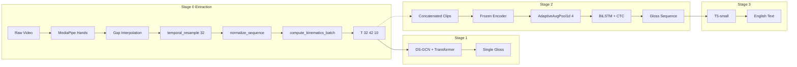

# SLT System Analysis — Expert Review

Independent architectural and code-level review of the 3-Stage Sign Language Translation system, grounded in the current codebase and aimed at maximising end-to-end translation accuracy (BLEU/WER).

---

## 1. System Mapping

End-to-end data flow from raw video to English text, with tensor shapes and code references.



### Stage 0 (Extraction) — `src/extract.py`

| Step | Implementation | Output shape |
|------|----------------|--------------|
| Input | Variable FPS/length video | — |
| Detection | MediaPipe Hands (`model_complexity=1`, `max_num_hands=2`), optional frame skip | Per-frame 21×3 per hand |
| Gap fill | `interpolate_hand(hand_seq, valid_indices, total_frames)` using **`np.interp`** (not scipy); 1-frame fallback via `np.tile` | Dense `[total_frames, 21, 3]` per hand |
| Concatenate | Left 0–20, right 21–41 → 42 nodes | `[N, 42, 3]` |
| Resample | `temporal_resample(seq, target_frames=32)` — linear interpolation in time over 0→1 | `[32, 42, 3]` |
| Normalize | `normalize_sequence`: wrist-centering (median of non-zero wrists), then scale by median wrist–middle-MCP bone length | `[32, 42, 3]` |
| Kinematics | `compute_kinematics_batch`: central-difference velocity/acceleration, mask channel (1.0 where hand ever present) | **`[32, 42, 10]`** float16 |
| Save | One `.npy` per video clip | — |

**Channel layout:** 3 (xyz) + 3 (vel) + 3 (acc) + 1 (mask) = 10. Training and inference pipelines that match this contract must output exactly 10 channels.

### Stage 1 (Isolated sign) — `src/train_stage_1.py`

- **Input:** `[B, 32, 42, 10]`.
- **Model:** `DSGCNEncoder` (spatial graph over 42 nodes, temporal convs, geometric features, positional encoding) → `nn.TransformerEncoder` (temporal) → `ClassifierHead` (frame attention + MLP).
- **Output:** Single gloss logits; argmax gives one class per clip.

### Stage 2 (Continuous recognition) — `src/train_stage_2.py`

- **Input:** Variable-length sequence of 32-frame clips: `[B, max_T, 42, 10]` with `x_lens`; `max_T` is a multiple of 32 (e.g. 6 clips → 192).
- **Data:** `SyntheticCTCDataset` loads per-gloss `.npy` files of shape `(32, 42, 10)` and concatenates them along time: `x = np.concatenate(arrays, axis=0)` → no transition frames between signs.
- **Forward:** Per sample, `valid_x = x[b, :x_lens[b]]`, reshaped to `(num_clips, 32, 42, 10)`. Frozen Stage 1 encoder → `[num_clips, 32, 256]` → `AdaptiveAvgPool1d(4)` → 4 tokens per clip → `pack_padded_sequence` → BiLSTM → linear → CTC logits. Training decoding: `decode_ctc` (greedy argmax + blank/duplicate collapse).
- **Inference (E2E):** `test_video_pipeline.py` and `camera_inference.py` use **CTC prefix beam search** (`_ctc_beam_search`), not greedy, over the same Stage 2 model.

### Stage 3 (Gloss → English) — `src/train_stage_3.py`

- **Input:** Gloss string (e.g. `"HELLO HOW YOU"`).
- **Model:** `t5-small` with prefix `"translate ASL gloss to English: "`.
- **Data:** CSV from `generate_stage3_data.py` (synthetic templates: SVO, TIME SVO, etc.).
- **Output:** Natural English via `model.generate(..., num_beams=4)`.

---

## 2. System Health Check

### Train/test contract (extraction and kinematics)

| Contract | Training (`extract.py`) | E2E inference (`test_video_pipeline.py`, `camera_inference.py`) | Real-time (`main_inference.py`) |
|----------|-------------------------|------------------------------------------------------------------|----------------------------------|
| Interpolation | `np.interp` in `interpolate_hand` | Same `interpolate_hand` (np.interp) ported | `interpolate_to_target` uses CubicSpline / scipy `interp1d` for 32-frame resample only; **no gap interpolation** (single-hand buffer) |
| Normalization | Wrist median center + bone-length scale | Same `normalize_sequence` (wrist + bone) | **Different:** `seq -= seq[:, 0:1, :]` (first landmark), scale by max norm |
| Kinematics | Central difference; 10 ch (xyz+vel+acc+mask) | Same; 10 ch | **9 ch only** (xyz+vel+acc); **no mask channel** |
| Temporal length | Always 32 frames per clip | 32 per window; sliding/segmentation as in pipeline | 32 via `interpolate_to_target` |

**Conclusion:** The pipelines that match the training distribution for full E2E evaluation are `test_video_pipeline.py` and `camera_inference.py`. `main_inference.py` does **not** match: different normalization, no mask channel (Stage 1 expects 10 channels in code), and no gap interpolation. Any metric or deployment that relies on `main_inference.py` alone is measuring a different distribution; for accuracy-focused work, prefer the test/camera pipeline or align `main_inference.py` with `extract.py` (see recommendations).

### Domain gap (Stage 2)

- **Training:** Synthetic sequences of back-to-back 32-frame clips; no inter-sign transitions, perfect alignment of sign boundaries to clip boundaries.
- **Inference:** Real continuous video: variable frames per sign, transition motion between signs, boundaries not aligned to 32-frame edges.

This is documented in `domain_gap_analysis.md`. The model never sees “transition” content, so it can hallucinate glosses on interstitial motion. Mitigations (transition-frame synthesis, overlapping windows, or real continuous data) are accuracy levers.

### CTC decoding

- **Training:** Greedy `decode_ctc` (argmax + collapse) for WER/validation.
- **Inference (test/camera):** CTC prefix beam search (`_ctc_beam_search`, beam_width=25), then multi-hypothesis scoring. So the report’s “Greedy Argmax decoding” applies to the training/validation path, not to the main E2E inference scripts.

### References to `extract_augment.py`

Comments in `main_inference.py` say normalization/kinematics match “extract_augment.py”. **There is no `extract_augment.py` in the repo.** Extraction and augmentation live in `extract.py` (and Stage 1/2 `online_augment`). Any new temporal/geometric augmentation (e.g. time warp) can be added in `extract.py` or a dedicated preprocessing script; the name “extract_augment” is only notional.

---

## 3. Scenario Analysis (“What-Ifs”)

### What-If 1: Train/test distribution matching (missing frames)

**Scenario:** During live or batch inference, missing frames (MediaPipe failures) are filled and interpolated in the same way as in `extract.py` so that kinematics and distribution match training.

**Impact:** **High.** Velocity/acceleration are derived from position. If missing frames are left zero or filled inconsistently, central-difference velocity spikes and the GCN sees unnatural motion; accuracy can drop sharply. Training already uses `interpolate_hand` (np.interp over `valid_indices`) so that filled frames are smooth before kinematics.

**Current state:** In `test_video_pipeline.py` and `camera_inference.py`, the same `interpolate_hand` and `temporal_resample` are used after collecting landmarks (with valid indices), so batch inference on full videos can match. For **real-time** streams, you do not have future frames, so you cannot interpolate “forward” within a 32-frame window without introducing latency: e.g. a sliding buffer (e.g. 32 or 48 frames), fill internal gaps with the same `interpolate_hand` over the buffer’s valid indices, then compute kinematics on the filled buffer and feed the last 32 frames (or the whole buffer if it is 32). That implies a small delay (~1 s at 32 fps) to keep the same math as training.

**Recommendation:** For offline/E2E evaluation, keep using the existing test/camera pipeline. For real-time, implement a buffer + gap-fill + kinematics step that mirrors `extract.py` and document the latency trade-off.

---

### What-If 2: Variable temporal resolution (dropping the 32-frame limit)

**Scenario:** Do not force every clip to 32 frames; feed variable-length sequences (e.g. 50–200 frames) through the same models.

**Impact:** **High risk of OOM and training instability** on Kaggle T4/P100.

- **Memory:** Transformer self-attention is O(T²). Going from 32 to ~200 frames increases attention size by ~40×; batch size would need to drop to 1–2, hurting gradient estimates.
- **Architecture:** Stage 1’s `DSGCNEncoder` and positional encoding are built for a fixed 32-time dimension; Stage 2’s forward does `valid_x.view(num_clips, 32, 42, 10)`, so it assumes chunking into 32-frame clips. Variable length would require padding, `pack_padded_sequence`/masking, and careful handling of temporal convs and positional encoding.
- **Normalization:** Resampling to 32 acts as temporal normalization (duration invariance). Removing it pushes the model to learn duration invariance from data.

**Recommendation:** Keep 32-frame fixed length for Stage 1 and the current Stage 2 design. For longer videos, keep using overlapping 32-frame windows (as in the test pipeline) and aggregate predictions (e.g. beam merge, voting), rather than feeding one long sequence.

---

### What-If 3: Signer speed augmentation

**Scenario:** Augment so that the model is robust to fast vs slow signers (e.g. temporal warping or frame dropping).

**Impact:** **Beneficial**, provided kinematics remain physically consistent.

**Constraint:** The 10-channel tensor is (xyz, vel, acc, mask). If you time-warp or resample **after** computing velocity/acceleration, the relationship between position and derivatives is broken (e.g. doubling speed should scale velocity, not just resample it). So augmentation must operate on **position only** `[T, 42, 3]`, then recompute kinematics (and mask) once.

**Implementation direction:** In the extraction path (or a preprocessing script that produces `[32, 42, 3]` before kinematics):

1. Apply a smooth time warp or resampling to the **xyz** sequence (e.g. warp time indices then `np.interp` or scipy onto a fixed grid).
2. Call the same `normalize_sequence` and `compute_kinematics_batch` (or the single-sequence equivalent used in the pipeline) so that vel/acc are derived from the warped positions.

This preserves physical consistency. Random frame dropping can be done on the **position** sequence before resampling to 32, then again recompute kinematics. The existing `online_augment` in Stage 1/2 does spatial (rotation, scale, noise) on the full 10-channel tensor; that is safe because it does not change the temporal ordering or the vel–acc relationship relative to xyz.

---

## 4. Top 3 Accuracy Recommendations

### 1. Align real-time inference with the training distribution

**Problem:** `main_inference.py` uses different normalization and 9-channel kinematics; Stage 1 expects 10 channels.

**Action:** In `main_inference.py` (or a shared “feature” module):

- Use the same normalization as `extract.py`: wrist-centering (median of wrists) and bone-length scaling (e.g. wrist–middle-MCP).
- After building the 32-frame position sequence, compute kinematics with **central differences** and add the **mask** channel (1.0 where hand present), so the tensor is `[32, 42, 10]`.

This removes a known train/test mismatch and avoids silent errors when the model receives 9-channel input.

### 2. Add transition-frame synthesis to Stage 2 training

**Problem:** Stage 2 sees only back-to-back 32-frame clips; real signing has transitions between signs.

**Action:** Inside `SyntheticCTCDataset.__getitem__`, between concatenated clips, optionally insert a short run of “transition” frames: e.g. linear interpolation of xyz from the last frame of clip A to the first frame of clip B, then compute kinematics on the full sequence (so vel/acc are consistent). Concatenate these segments so the total length is still a multiple of 32 (pad or trim the transition to preserve `T % 32 == 0`). Start with a low probability (e.g. 30%) and 3–8 transition frames so the model sees both clean boundaries and short transitions.

### 3. Add temporal speed augmentation in the extraction path

**Problem:** Signer speed varies; the model sees only one temporal sampling per video.

**Action:** In the code path that produces `[32, 42, 3]` (before kinematics), apply a temporal warp to the **xyz** sequence only: e.g. map time `t ∈ [0,1]` to `t' = t + α·t·(1−t)` with small random `α`, resample to 32 frames, then run the existing `normalize_sequence` and `compute_kinematics_batch`. This keeps physics correct and improves robustness to signing speed. Can be added in `extract.py` for offline data generation or in a separate augmentation script that writes `(32, 42, 10)` files.

---

## 5. Implementation Snippets

Snippets are aligned with current APIs and tensor shapes; they are examples, not necessarily drop-in replacements.

### Snippet A: Transition-frame insertion (concept for `SyntheticCTCDataset`)

Insert between loading clips and concatenating. Ensures total length remains divisible by 32.

```python
import numpy as np
import random

def insert_transition_frames(clip_list, prob=0.3, min_frames=3, max_frames=8):
    """Insert interpolated transition segments between clips. Total length stays multiple of 32."""
    if len(clip_list) <= 1:
        return np.concatenate(clip_list, axis=0) if clip_list else np.zeros((0, 42, 10), dtype=np.float32)
    out = [clip_list[0]]
    for i in range(1, len(clip_list)):
        if random.random() < prob:
            n = random.randint(min_frames, max_frames)
            # xyz only (channels 0:3)
            start_xyz = out[-1][-1, :, :3].copy()
            end_xyz   = clip_list[i][0, :, :3].copy()
            alphas = np.linspace(0, 1, n, dtype=np.float32)[:, None, None]
            trans_xyz = (1 - alphas) * start_xyz + alphas * end_xyz
            # Approximate vel/acc as zero for short transition; mask = 1
            vel_acc_mask = np.zeros((n, 42, 7), dtype=np.float32)
            vel_acc_mask[:, :, 6] = 1.0  # mask channel
            trans = np.concatenate([trans_xyz, vel_acc_mask], axis=-1)
            out.append(trans)
        out.append(clip_list[i])
    seq = np.concatenate(out, axis=0)
    # Ensure length is multiple of 32 (trim or pad)
    T = seq.shape[0]
    if T % 32 != 0:
        new_T = (T // 32) * 32
        if new_T == 0:
            new_T = 32
        if T >= new_T:
            seq = seq[:new_T]
        else:
            seq = np.concatenate([seq, np.tile(seq[-1:], (new_T - T, 1, 1))], axis=0)
    return seq
```

Integration point: in `__getitem__`, build `arrays` (list of `(32, 42, 10)` arrays), then optionally run `insert_transition_frames(arrays, ...)`. To keep CTC alignment (one gloss per 32-frame clip), either: (1) trim the returned sequence to exactly `len(arrays)*32` (e.g. by temporal resampling), so `num_clips` equals the number of gloss targets; or (2) allow longer sequences and pad the target list with blank indices for the extra clips. Option (1) is simpler: after inserting transition frames, resample the full sequence back to `len(arrays)*32` so the model sees transition-like content within the same clip count.

### Snippet B: Temporal time warp on XYZ (before kinematics)

Apply to a sequence of shape `[T, 42, 3]` (e.g. after `temporal_resample` to 32 or before it). Then call your existing `normalize_sequence` and `compute_kinematics_batch`.

```python
import numpy as np

def temporal_warp_xyz(xyz: np.ndarray, max_warp: float = 0.2) -> np.ndarray:
    """Warp time axis of [T, 42, 3] positions. Use before normalize_sequence and compute_kinematics."""
    T, V, C = xyz.shape
    if T < 2:
        return xyz
    orig_t = np.arange(T, dtype=np.float64)
    warp = np.random.uniform(-max_warp, max_warp)
    norm_t = orig_t / (T - 1)
    warped_norm = norm_t + warp * norm_t * (1 - norm_t)
    warped_t = np.sort(warped_norm * (T - 1))
    flat = xyz.reshape(T, -1)
    warped_flat = np.column_stack([
        np.interp(orig_t, warped_t, flat[:, j]) for j in range(flat.shape[1])
    ])
    return warped_flat.reshape(T, V, C).astype(np.float32)
```

Use in extraction: after building `[N, 42, 3]` (e.g. after `temporal_resample` to 32), call `warped = temporal_warp_xyz(resampled)` (or warp before resampling if you prefer), then `normalized = normalize_sequence(warped, l_ever, r_ever)` and `compute_kinematics_batch(normalized[np.newaxis], l_ever, r_ever).squeeze(0)`.

### Snippet C: Sliding buffer for live inference (match training gap-fill)

Concept for a real-time loop that matches training interpolation and kinematics:

```python
# In the live loop, maintain a buffer of raw landmark arrays (e.g. 21*3 or 42*3 per frame)
from collections import deque

frame_buffer = deque(maxlen=48)  # or 32
valid_indices_list = []  # indices where detection succeeded

def on_frame(raw_xyz_42x3):
    """raw_xyz_42x3: shape (42, 3) or None if no detection."""
    if raw_xyz_42x3 is not None:
        frame_buffer.append(raw_xyz_42x3.copy())
        valid_indices_list.append(len(frame_buffer) - 1)
    else:
        frame_buffer.append(None)
    if len(frame_buffer) < 32:
        return None
    # Use last 32 frames; only use frames where we have detection
    recent = list(frame_buffer)[-32:]
    valid = [i for i in range(32) if recent[i] is not None]
    if len(valid) < 2:
        return None
    arr = np.array([recent[i] for i in range(32) if recent[i] is not None])
    valid_idx = np.array([i for i in range(32) if recent[i] is not None], dtype=np.float64)
    # Interpolate to full 32 frames using same logic as extract.interpolate_hand
    # For combined 42x3: interpolate_hand is per-hand; here we have 32,42,3 after building from buffer
    # Build dense 32,42,3 by interpolating missing positions
    x_new = np.arange(32, dtype=np.float64)
    full_seq = np.zeros((32, 42, 3), dtype=np.float32)
    for node in range(42):
        for c in range(3):
            full_seq[:, node, c] = np.interp(x_new, valid_idx, arr[:, node, c])
    # Then normalize_sequence + compute_kinematics -> [32, 42, 10]
    # Return full_seq for downstream normalize + kinematics
    return full_seq
```

Downstream: run `normalize_sequence(full_seq, l_ever=True, r_ever=True)` and your single-sequence `compute_kinematics` that outputs `[32, 42, 10]`, then feed to the model. This keeps gap-fill and kinematics aligned with training.

---

## 6. Consistency Notes

- All tensor shapes above match the code: `(32, 42, 10)` per clip, `[B, 32, 42, 10]` for Stage 1, `[B, T, 42, 10]` with `T % 32 == 0` for Stage 2.
- Extraction uses **NumPy** `np.interp` in `interpolate_hand` and `temporal_resample`; no dependency on scipy for the main path in `extract.py`.
- Stage 2 training decoding is greedy (`decode_ctc`); E2E inference in `test_video_pipeline.py` and `camera_inference.py` uses CTC beam search.
- Recommendations assume fixed 32-frame clips and existing Kaggle hardware; no change to the core Stage 1/2 architecture (frozen encoder, AdaptiveAvgPool1d(4), BiLSTM, CTC).
